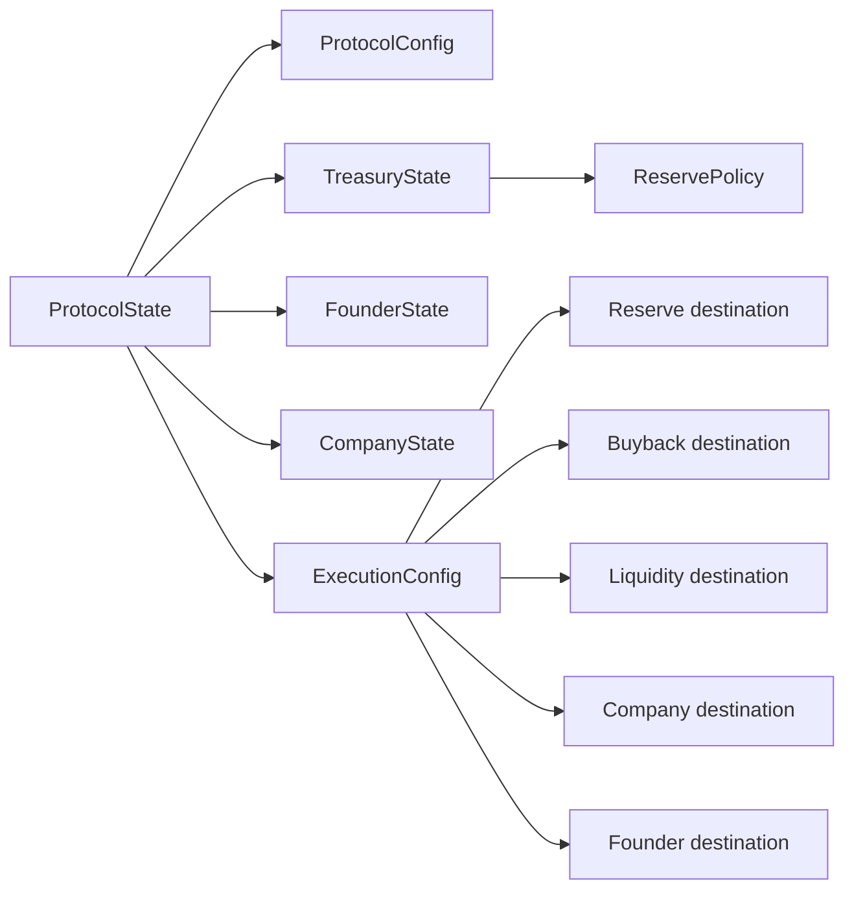

# Account Model

## Verified Devnet accounts

| Role | Address |
|---|---|
| Protocol State | `6gm3ErHmKPvtEncQo9UVVM73R8BJKDugtevwAzZFSmn4` |
| Protocol Configuration | `45ykMagNoeSXhEDWmBHPeR9yHvB6CTju2EmrnwQQ8NVG` |
| Treasury State | `4JNbTpsaVk2yedE8stQxNZboNwJzLj3cfxgsGvZdn9iW` |
| Founder State | `G6FcSoxrM68e21uYz9AWghC4BRnL13WU7FgxwpNmNVWh` |
| Company State | `7irjZBduNKmnNsMPSDXZyJR2AyFT11iVMfCcBfTDWrBn` |
| Execution Configuration | `AsjV6WE6zVVsWLdQGepV2LYwaNCCW7F5K3721UK7C1jV` |
| Reserve Policy | `GgYfq8aFwgp8H57zgCZn4qrikLs3yUEBapjUndrcvir4` |

These are deployment-specific Devnet addresses.

## Ownership rules

RBVR state accounts must be owned by the RBVR program. Token accounts must be owned by the SPL Token program. Account role, address, owner, discriminator, mint, and authority must all be validated independently.

## Relationship model

## Important field notes

Some decoded `ProtocolState` links were the default public key in the verified Devnet deployment. Those fields must be interpreted from source; they may be placeholders, legacy fields, or reserved extension points.

## Compatibility

Changing account layouts can make deployed state unreadable. Layout changes require versioning, updated account lengths, migration planning, compatibility tests, and explicit deployment review.
