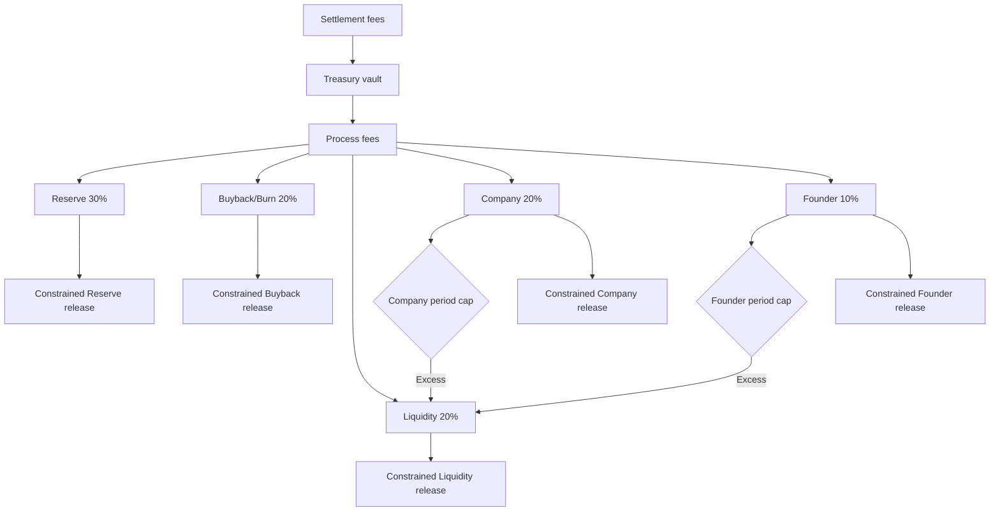

# Architecture

## Purpose

RBVR receives settlement-token fees, accounts for them, allocates them deterministically, and releases each allocation only through constrained instructions.

## Design principles

- deterministic integer arithmetic;
- canonical PDA topology;
- locked token destinations;
- one-time initialization;
- separation of allocation accounting and token release;
- period-based Company and Founder controls;
- overflow to Liquidity Growth;
- fail-closed validation;
- constrained permissionless Reserve deployment.

## Core state

### ProtocolState

Root account linking protocol configuration, treasury, Founder controls, Company controls, authority, pause state, version, bump, and health-related fields.

### ProtocolConfig

Stores the locked basis-point allocation:

- Reserve: 3000;
- Buyback/Burn: 2000;
- Liquidity: 2000;
- Company: 2000;
- Founder: 1000.

### TreasuryState

Stores the settlement mint and vault, cumulative received and allocated fees, pending buckets, lifetime allocations, released balances, processing epoch, and waterfall state.

### ExecutionConfig

Locks the protocol state, settlement mint, and five token destinations.

### FounderState

Stores recipient, period cap, current-period earned amount, lifetime earned amount, period metadata, current tier, enabled flag, and bump.

### CompanyState

Stores recipient, period cap, current-period spent amount, lifetime spent amount, period metadata, enabled flag, and bump.

### ReservePolicy

Stores the Reserve floor, deployment ratio, cooldown, last deployment time, and lifetime deployed amount.

## Fee flow

## Integrity Firewall

The integrity layer validates canonical PDAs, bumps, versions, protocol links, settlement-mint consistency, locked destinations, account uniqueness, and other security-critical invariants.

## Reserve Spillway

The Spillway is permissionless but policy-constrained. A caller may trigger eligible Reserve surplus deployment, but cannot choose the destination, bypass the minimum floor, alter the deployment ratio, or ignore cooldown.

## Authority

Protocol authority and Solana upgrade authority are separate concepts. The verified Devnet program remained upgradeable. Authority revocation must occur only after independent review and final release approval.

## Source of truth

1. deployed program and state for deployment facts;
2. Rust source for execution behaviour;
3. IDL for interface and layouts;
4. tests for expected behaviour;
5. documentation for explanation.
